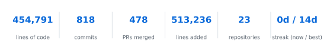
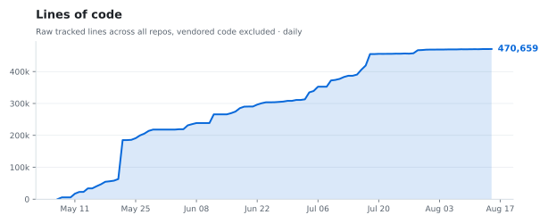
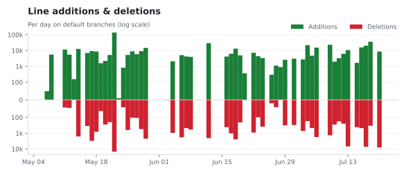
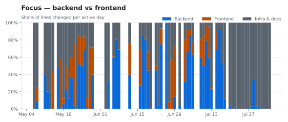
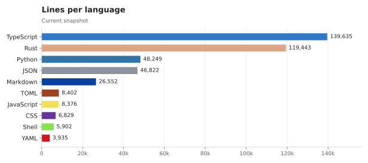
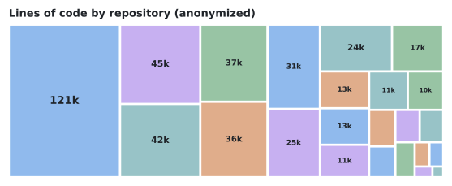
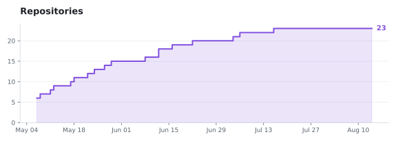
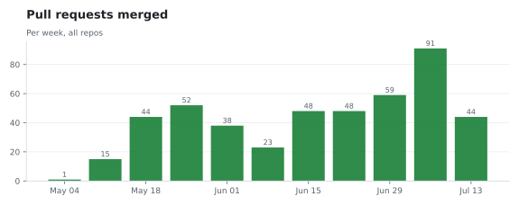
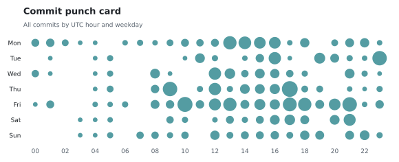

  <picture>
    <source media="(prefers-color-scheme: dark)" srcset="assets/btnet_logo_dark.png" />
    
  </picture>

<strong>Institutional market-neutral crypto basis trading.</strong>

Targeting up to 40% gross annual return &middot; USDT-denominated &middot; multi-venue

---

## What we do

BTNET Quantitative runs delta-neutral **basis and funding-capture** strategies across
major centralized and on-chain venues. Returns come from market structure —
funding and basis spreads — not directional bets. The platform pairs a
low-latency execution stack with hard risk fuses, continuous margin/MMR
monitoring, and transparent, per-account NAV reporting.

- **Market-neutral by design** — long spot against short perpetual/futures to harvest basis and funding.
- **Multi-venue** — Binance, Bybit, KuCoin, Gate, and Hyperliquid.
- **Institutional controls** — per-venue exposure limits, automated fuses, read-only custody segregation.
- **Investor-grade reporting** — daily NAV strikes, per-lot performance, downloadable statements.

## Links

- Fund overview: https://basistrading.net
- Investor portal (NAV & statements): https://wealth-tokyo.basistrading.net

---

## Engineering

Aggregate development activity across all BTNET repositories since the
organization was created (May 2026). Sampled daily on default branches;
vendored third-party code is excluded. Updated automatically every day.

  <picture>
    <source media="(prefers-color-scheme: dark)" srcset="assets/stats/summary_dark.svg" />
    
  </picture>

<picture>
  <source media="(prefers-color-scheme: dark)" srcset="assets/stats/loc_dark.svg" />
  
</picture>

<picture>
  <source media="(prefers-color-scheme: dark)" srcset="assets/stats/churn_dark.svg" />
  
</picture>

<picture>
  <source media="(prefers-color-scheme: dark)" srcset="assets/stats/focus_dark.svg" />
  
</picture>

<picture>
  <source media="(prefers-color-scheme: dark)" srcset="assets/stats/languages_dark.svg" />
  
</picture>

<picture>
  <source media="(prefers-color-scheme: dark)" srcset="assets/stats/treemap_dark.svg" />
  
</picture>

<picture>
  <source media="(prefers-color-scheme: dark)" srcset="assets/stats/repos_dark.svg" />
  
</picture>

<picture>
  <source media="(prefers-color-scheme: dark)" srcset="assets/stats/prs_dark.svg" />
  
</picture>

<picture>
  <source media="(prefers-color-scheme: dark)" srcset="assets/stats/punchcard_dark.svg" />
  
</picture>

---

Target returns are objectives, not guarantees. Trading digital assets involves substantial risk. This profile is informational and is not an offer or solicitation to invest.
